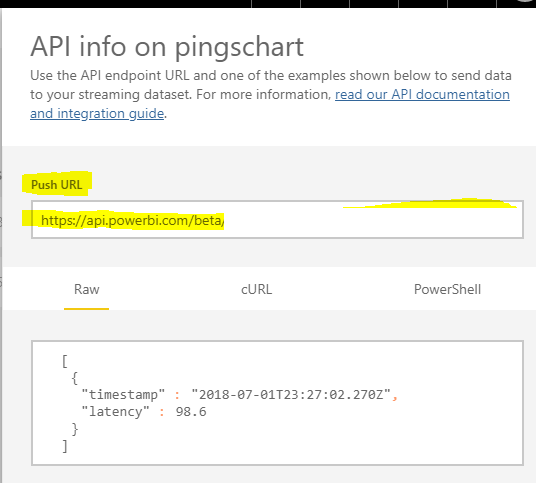
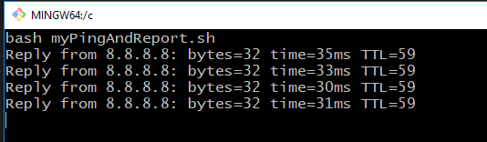
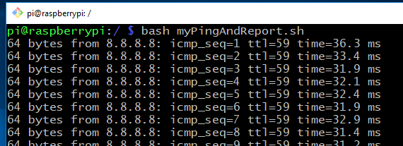
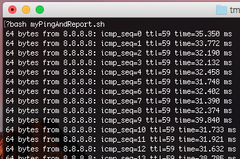

# Stream your Data within Power BI

## NOTE: for demostration purposes ONLY

## Stream your own near realtime data within your Power BI Dashboard

The animated gif below:
- on the left, a dashboard tile containing a line chart.
- on the right, a overlay of a SSH session running a bash script.

The bash script is running a continous network *ping* running on a local raspberry pi. The ping results are being echoed to the terminal in addition to being sent to the Power BI Service.

The line chart in turn is updating continously as the ping data is received.


## Create a New Streaming dataset within the Power BI service

Name the datset whatever you like. This dataset will be referenced later when creating the dashboard tile to define the source of the data.

For this example, only two values will be contained in this Power BI dataset for a simple line chart:
- `timestamp` column defined as a **DateTime** for the X axis
- `latency` column defined as a **Number** for the Y axis

Its assumed the common ping utilities always report its time in milliseconds.


## Push Data into Power BI

After creating the dataset, a **Push URL** will be provided. 



Copy this URL and paste it into the bash script `myPingAndReport.sh`
For example, the **PUSH URL** will be something like 

```
https://api.powerbi.com/..../rows?key=....
```

Copy your URL and paste it into the script on line 5 ...

```
REST_API_URL='https://api.powerbi.com/..../rows?key=....'
```

### Execute the BASH script

The BASH script has been tested to run on a raspberry pi running Raspbian and within a GIT BASH terminal on Windows 10.

**NOTE: if running on windows, by default, *ping* will only execute for a count of 4. ** You could adjust it to run continously with the argument of `-t`

```
bash myPingAndReport.sh
```

If all is running correctly, the terminal should start display the output of the ping.

### Windows Git Bash


### Raspberry


### Mac OS
For retrieving the system date, remove the UTC argument and adjust the date formatting to remove milliseconds
```
timestamp=`date +%FT%T`
```


## Create your Dashboard Tile

1. Create a New Dashboard or select an existing dashboard
1. Add a Tile
1. Select the Dataset you created above as your data source
1. Select the **Line chart** visualization type
1. Select the **timestamp** for the x axis
1. Select the **latency** for the y axis

Click **Apply** and you should start to see the line chart updating in near realtime while you are **pushing** you data into the service.


## Viz Type Options


## References

[Building a Real-time IoT Dashboard with Power BI: A Step-by-Step Tutorial](https://powerbi.microsoft.com/en-us/blog/using-power-bi-real-time-dashboards-to-display-iot-sensor-data-a-step-by-step-tutorial/)
